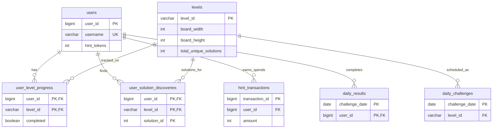

# SQL Data Specification — Garz Tile Puzzle

Reference for the **MySQL** database used for online player features: accounts, progress, daily challenges, and the hint economy.

**Related docs:** canonical level/solve JSON in [`json-data-spec.md`](json-data-spec.md); hint rules in [`hint-economy.md`](hint-economy.md); Docker ops in [`docker/mysql/README.md`](../docker/mysql/README.md); **auth & email** in [`auth-email-setup.md`](auth-email-setup.md); planned API phases in [`plans/future-needs.md`](plans/future-needs.md).

---

## 1. JSON vs MySQL — what lives where

| Data | Storage | Notes |
|------|---------|-------|
| Level definitions (board, tile bag, blockers) | **JSON** — `data/levels/*.json` | Authoritative for gameplay |
| Solve libraries (all layouts) | **JSON** — `solves/<levelId>.json` | Shipped as `solves.zip`; not in git |
| Tile geometry / tilesets | **JSON** — `data/tiles/*` | Static catalog |
| User accounts, login | **WordsOnline** — `users` (shared) | See [`auth-email-setup.md`](auth-email-setup.md); `tile_profiles` in `tilegame` |
| Per-user completion & discoveries | **MySQL** — `user_level_progress`, `user_solution_discoveries` | Planned |
| Daily puzzle schedule & leaderboard | **MySQL** — `daily_challenges`, `daily_results` | Planned |
| Hint balance & history | **MySQL** — `users.hint_tokens`, `hint_transactions` | Planned |
| Level metadata mirror (for joins) | **MySQL** — `levels` | Import from JSON catalog; script TBD |

The web app **today** loads levels and solves via `fetch()` from `/data/*` and `/solves/*` (see `scripts/server.py`). **No application code connects to MySQL yet.** The schema is forward-looking for account-backed features.

---

## 2. How the database loads

### 2.1 Docker Compose (intended setup)

From repo root:

```powershell
copy .env.example .env
docker compose up -d mysql
```

| Setting | Default | Source |
|---------|---------|--------|
| Image | `mysql:8.4` | `docker-compose.yml` |
| Database | `tilegame` | `MYSQL_DATABASE` |
| App user | `tilegame` | `MYSQL_USER` |
| Port (host) | `3306` | `MYSQL_PORT` |
| Data volume | `tilegame_mysql_data` | Persists across restarts |

**First boot only:** MySQL runs every `*.sql` file in `docker/mysql/init/` in filename order:

| File | Purpose |
|------|---------|
| `01-schema.sql` | Creates all V1 tables (empty) |
| `02-hint-transactions-reference-id.sql` | Idempotent upgrade if an older volume lacks `reference_id` |

Init scripts run **once** when the data volume is new. They do **not** seed levels, users, or daily schedules.

### 2.2 Current compose state

The `mysql` service and `web` → `mysql` `depends_on` / env block are **commented out** in `docker-compose.yml` to reduce RAM during solver enumeration. Re-enable when account/API work starts. Enumeration and ingest **do not** use MySQL.

### 2.3 Connection strings

**From host (e.g. GUI client):**

| Field | Value |
|-------|-------|
| Host | `127.0.0.1` |
| Port | `3306` (or `.env` override) |
| Database | `tilegame` |
| User | `tilegame` |
| Password | `.env` → `MYSQL_PASSWORD` |

```powershell
docker compose exec mysql mysql -utilegame -p tilegame
```

**From `web` container (when wired up):**

| Field | Value |
|-------|-------|
| Host | `mysql` |
| Port | `3306` |
| Database / user / password | Same as `.env` |

Env vars expected on the app side: `MYSQL_HOST`, `MYSQL_PORT`, `MYSQL_DATABASE`, `MYSQL_USER`, `MYSQL_PASSWORD`.

### 2.4 Upgrades and reset

**Upgrade an existing volume** (add `reference_id` + non-negative hint constraint):

```powershell
docker compose exec -T mysql mysql -uroot -p tilegame < docker/mysql/init/02-hint-transactions-reference-id.sql
```

**Destructive reset** (wipes all data):

```powershell
docker compose down
docker volume rm garz-puzzle_tilegame_mysql_data
docker compose up -d mysql
```

---

## 3. Schema version

- **Version:** V1 (defined in `docker/mysql/init/01-schema.sql`)
- **Engine:** MySQL 8.4 (InnoDB implied)
- **Charset:** server default (recommend `utf8mb4` for usernames/emails when configuring app)

Tables **not** in V1 but mentioned in design docs:

- `purchases` — real-money hint packs ([`hint-economy.md`](hint-economy.md)); record store grants as `hint_transactions` until then

---

## 4. Entity relationships



---

## 5. Table reference

### 5.1 `users`

**Purpose:** Player accounts, cached hint balance, rank, and streak stats.

| Column | Type | Constraints | Description |
|--------|------|-------------|-------------|
| `user_id` | `BIGINT` | PK, auto-increment | Internal id |
| `username` | `VARCHAR(50)` | NOT NULL, UNIQUE | Login / display handle |
| `email` | `VARCHAR(255)` | UNIQUE, nullable | Optional |
| `password_hash` | `VARCHAR(255)` | NOT NULL | App-defined hash (bcrypt/argon2, etc.) |
| `rank` | `ENUM(...)` | DEFAULT `'Connector'` | Progression tier (see below) |
| `hint_tokens` | `INT` | NOT NULL, DEFAULT `5`, CHECK `>= 0` | **Cached** balance; see hint economy |
| `current_streak` | `INT` | NOT NULL, DEFAULT `0` | Active daily/login streak |
| `best_streak` | `INT` | NOT NULL, DEFAULT `0` | Personal best streak |
| `created_at` | `DATETIME` | NOT NULL, DEFAULT now | Registration time |
| `last_login` | `DATETIME` | NULL | Last successful login |

**`rank` enum values (low → high):** `Connector`, `Pathfinder`, `Wayfinder`, `Routefinder`, `Trailblazer`, `Legend`.

**Used for:** authentication, profile, fast hint balance reads, streak UI.

---

### 5.2 `levels`

**Purpose:** Relational mirror of catalog level ids so progress and daily features can `JOIN` without parsing JSON. **Does not** store tile bags, blockers, or solve layouts.

| Column | Type | Constraints | Description |
|--------|------|-------------|-------------|
| `level_id` | `VARCHAR(32)` | PK | Same as JSON `id` (e.g. `5x6-0B-AXV`) |
| `board_width` | `INT` | NOT NULL | Catalog `board.cols` |
| `board_height` | `INT` | NOT NULL | Catalog `board.rows` |
| `tier` | `VARCHAR(10)` | NOT NULL | e.g. `0B` from id |
| `total_unique_solutions` | `INT` | NOT NULL | From catalog `totalUniqueSolutions` or solve file |
| `daily_eligible` | `BOOLEAN` | NOT NULL, DEFAULT `FALSE` | **TRUE** = level is in the daily schedule pool — **exclude from adventure/campaign**. Synced from `daily_challenges` via `import-catalog-to-mysql.ps1 -SyncDailyEligible`. |
| `target_time_seconds` | `INT` | NULL | Optional par time for challenges |

**Board size mapping (important):**

Catalog labels like **`5x6`** mean **rows = 6, cols = 5** in JSON (`board.rows`, `board.cols`). In SQL:

```text
board_height = board.rows
board_width  = board.cols
```

Example: `5x6-0B-AXV` → `board_width = 5`, `board_height = 6`.

**Population:** One-time or periodic import from `data/levels/levels.json` (or bucket files). Script is **TBD**; see [`docker/mysql/README.md`](../docker/mysql/README.md).

**Used for:** FK targets from progress/daily tables; filtering by tier/size; displaying solution totals without loading solve JSON.

---

### 5.3 `user_level_progress`

**Purpose:** Aggregate per-user stats for each level (completion, best time, how many solutions found).

| Column | Type | Description |
|--------|------|-------------|
| `user_id` | `BIGINT` | FK → `users` |
| `level_id` | `VARCHAR(32)` | FK → `levels` |
| `completed` | `BOOLEAN` | DEFAULT `FALSE` — at least one valid completion |
| `completion_count` | `INT` | DEFAULT `0` — total successful finishes |
| `best_time_seconds` | `INT` | NULL — personal best |
| `solutions_found_count` | `INT` | DEFAULT `0` — should match count of rows in `user_solution_discoveries` for this user+level |
| `first_completed_at` | `DATETIME` | NULL |
| `last_completed_at` | `DATETIME` | NULL |

**Primary key:** `(user_id, level_id)`.

**Used for:** level select UI (completed badge, stars), progression gates, hint eligibility rules.

**Planned API:** `GET /api/progress/:levelId` ([`future-needs.md`](plans/future-needs.md)).

---

### 5.4 `user_solution_discoveries`

**Purpose:** Record which **canonical solution indices** a player has found. Supports “solutions library” unlock: hide layouts until discovered.

| Column | Type | Description |
|--------|------|-------------|
| `user_id` | `BIGINT` | FK → `users` |
| `level_id` | `VARCHAR(32)` | FK → `levels` |
| `solution_id` | `INT` | Index into the level’s solve doc (see §6) |
| `discovered_at` | `DATETIME` | DEFAULT now |

**Primary key:** `(user_id, level_id, solution_id)`.

**Used for:** `GET /api/founds/:levelId` — return only placements the user has unlocked.

**Write path (planned):** `POST /api/solve/check` validates a submission against `solves/<levelId>.json`, then inserts a row if new.

---

### 5.5 `daily_challenges`

**Purpose:** Pre-scheduled daily level for each calendar date.

| Column | Type | Description |
|--------|------|-------------|
| `challenge_date` | `DATE` | PK — calendar day (UTC or app timezone TBD) |
| `level_id` | `VARCHAR(32)` | FK → `levels` |
| `theme` | `VARCHAR(50)` | NULL — optional label |
| `total_solutions` | `INT` | NOT NULL — copy from level at schedule time |
| `notes` | `VARCHAR(255)` | NULL — editorial |
| `original_schedule_date` | `DATE` | NULL — if a day was swapped/rescheduled |
| `created_at` | `DATETIME` | DEFAULT now |

**Seeding:** Not in schema init. Product target: **≥ 730 days** pre-filled at launch ([`docker/mysql/README.md`](../docker/mysql/README.md)).

**Used for:** “Today’s puzzle” screen, daily hint rewards, streak rules.

---

### 5.6 `daily_results`

**Purpose:** One row per user per daily challenge — leaderboard and completion proof.

| Column | Type | Description |
|--------|------|-------------|
| `challenge_date` | `DATE` | Part of PK |
| `user_id` | `BIGINT` | Part of PK; FK → `users` |
| `completion_time_seconds` | `INT` | NOT NULL |
| `solution_id` | `INT` | Which canonical solution they used |
| `completed_at` | `DATETIME` | NOT NULL |

**Primary key:** `(challenge_date, user_id)`.

**Index:** `idx_daily_results_leaderboard (challenge_date, completion_time_seconds)` — fast daily leaderboard queries.

**Used for:** daily leaderboard, streak updates, hint grants (`Daily Challenge Reward`).

---

### 5.7 `hint_transactions`

**Purpose:** **Source of truth** for hint gains and spends. `users.hint_tokens` is a cache updated in the same DB transaction as inserts here.

| Column | Type | Description |
|--------|------|-------------|
| `transaction_id` | `BIGINT` | PK, auto-increment |
| `user_id` | `BIGINT` | FK → `users` |
| `amount` | `INT` | Signed: positive = grant, negative = spend |
| `reason` | `VARCHAR(100)` | App-defined code (see hint economy) |
| `reference_id` | `VARCHAR(50)` | NULL — level id, date, purchase id, etc. |
| `created_at` | `DATETIME` | DEFAULT now |

**Rules:** Never allow negative balance on spend. See [`hint-economy.md`](hint-economy.md) for reason codes and reconciliation.

**Example reasons:**

| `amount` | `reason` |
|----------|----------|
| +1 | Puzzle Completion |
| +1 | Time Bonus |
| -1 | Random Solution Hint |
| -2 | Start Tile Hint |
| -2 | End Tile Hint |
| +1 | Daily Challenge Reward |
| +1 | Watch Advertisement |
| +25 | Hint Pack Small |
| +100 | Hint Pack Large |

---

## 6. Linking SQL to JSON solve docs

Solve files (`solves/<levelId>.json`) store an array `solutions[]`. Each entry has an `id` string (e.g. `"solve-1"`, `"solve-2"`) and `placements[]`.

**Convention for `solution_id` (when API is implemented):**

- Use **1-based index** matching solve order: first solution → `1`, second → `2`, …
- Alternatively map from the numeric suffix of `"solve-N"` if ids stay stable
- The API must use the **same** mapping when checking submissions and when returning unlocked layouts

**`total_unique_solutions` in `levels`** should stay in sync with:

- JSON catalog field `totalUniqueSolutions`, and/or
- `solutions.length` in the solve file after enumeration/ingest

Catalog sync today is JSON-only (`scripts/sync-catalog-path-count-from-solves.js`); a future `levels` import should read the same sources.

---

## 7. Planned data flow (not built yet)

```text
┌─────────────────┐     fetch      ┌──────────────────┐
│  Web client     │ ──────────────►│  JSON static     │
│  (game UI)      │                │  data/ + solves/ │
└────────┬────────┘                └──────────────────┘
         │
         │  REST (future)
         ▼
┌─────────────────┐     SQL        ┌──────────────────┐
│  App backend    │ ◄─────────────►│  MySQL tilegame  │
│  (TBD)          │                │  users, progress │
└─────────────────┘                │  daily, hints    │
                                     └──────────────────┘
```

**Phase 1 (JSON-backed API):** progress in `data/progress/users/<userId>.json` — see [`future-needs.md`](plans/future-needs.md).

**Phase 2:** migrate progress tables to MySQL; keep the same API contract.

**Level import (parallel track):** batch job reads `data/levels/levels.json` → upserts `levels` rows.

**Daily seed (parallel track):** admin script picks `daily_eligible` levels → inserts `daily_challenges` for N days.

---

## 11. Adventure progression (V2)

**Design:** fully data-driven; no hardcoded thresholds in app code. Authoritative CSV: [`data/adventure_solution_distribution.csv`](../data/adventure_solution_distribution.csv).

**Import:** `.\scripts\import-adventure-map.ps1`

### CSV → database mapping

| CSV column | Meaning |
|------------|---------|
| `Adv_ID` | Global adventure sequence; puzzles grouped between challenge markers |
| `CH-lvl` | `T` = challenge puzzle; ends the current Lx-y step (80 total) |
| `level_id` | Catalog level assigned to this adventure slot |
| `total_unique_solutions` | Challenge `required_solution_count` when `CH-lvl=T` |

Derived on import (not stored in CSV):

| DB column | Rule |
|-----------|------|
| `rank_id` / `sub_level` | Step 1 → L1-1, step 10 → L1-10, step 11 → L2-1, … step 80 → L8-10 (from challenge order) |
| `levels_required` | Puzzle count in that step |
| `cumulative_levels_required` | Running sum of `levels_required` over all 80 steps |
| `puzzle_order` | Order within step by `Adv_ID`, then file row |
| `is_challenge` | `CH-lvl=T` |
| `required_solution_count` | `1` for normal puzzles; `total_unique_solutions` for challenge |

### `adventure_rank`

Eight ranks (seeded by import, canonical list: `data/adventure_ranks.json`):

| rank_id | code | name | badge_image |
|--------:|------|------|-------------|
| 1 | L1 | Wanderer | `/img/ranks/Wanderer.png` |
| 2 | L2 | Pathfinder | `/img/ranks/Pathfinder.png` |
| 3 | L3 | Trailblazer | `/img/ranks/Trailblazer.png` |
| 4 | L4 | Navigator | `/img/ranks/Navigator.png` |
| 5 | L5 | Waymaker | `/img/ranks/Waymaker.png` |
| 6 | L6 | Route Master | `/img/ranks/RouteMaster.png` |
| 7 | L7 | Grand Cartographer | `/img/ranks/GrandCartographer.png` |
| 8 | L8 | Vaultwalker | `/img/ranks/Vaultwalker.png` |

Badge fields (`badge_image`, `badge_locked_image`, `unlock_message`, …) live here for UI.

### `adventure_progression`

80 rows: L1-1 … L8-10. Runtime lookup when player solves a level:

```sql
SELECT rank_id, sub_level
FROM adventure_progression
WHERE cumulative_levels_required <= :total_levels_solved
ORDER BY cumulative_levels_required DESC
LIMIT 1;
```

Update `player_progress.current_rank_id`, `current_sub_level`, `total_levels_solved`.

### `adventure_puzzle`

Maps catalog `level_id` to adventure step `(rank_id, sub_level)` with ordering.

| Column | Purpose |
|--------|---------|
| `puzzle_order` | 1…N within step |
| `level_id` | FK → `levels` |
| `is_challenge` | **TRUE** for exactly one row per step — the **last** puzzle |
| `required_solution_count` | 1 for normal puzzles; `levels.total_unique_solutions` for challenge |

**Step complete when:** every normal puzzle solved once; challenge has `solutions_found_count >= required_solution_count`.

**Import:** `.\scripts\import-adventure-map.ps1` from [`data/adventure_solution_distribution.csv`](../data/adventure_solution_distribution.csv). Step boundaries use `CH-lvl=T`; `Adv_ID` ordering assigns puzzles within each Lx-y step.

### `adventure_postgame_puzzle`

Levels with `Adv_ID` **after** the final `CH-lvl=T` (L8-10 challenge). Still adventure play once the player has reached **L8-10**; does **not** advance rank or sub-level.

| Column | Purpose |
|--------|---------|
| `puzzle_order` | Play order after max rank (1…N) |
| `adv_id` | From CSV `Adv_ID` |
| `level_id` | FK → `levels` |
| `required_solution_count` | Usually 1 (normal solve) |

Populated from the same CSV import as `adventure_puzzle`.

### `adventure_reward`

Future rewards (`badge`, `avatar`, `theme`, …). Empty at launch.

### `player_progress`

Per-user adventure state. `player_id` → `users.user_id`.

| Column | Purpose |
|--------|---------|
| `total_levels_solved` | Global solve counter for rank lookup |
| `current_rank_id` / `current_sub_level` | Cached position (reconcile from counter + `adventure_progression`) |
| `last_updated` | Timestamp |

---

## 12. Indexes (V1 + adventure)

| Index | Table | Columns | Use |
|-------|-------|---------|-----|
| PK | all | per table | — |
| `idx_daily_results_leaderboard` | `daily_results` | `challenge_date`, `completion_time_seconds` | Daily leaderboard |
| `idx_user_progress_user` | `user_level_progress` | `user_id` | Load all progress for a user |
| `idx_user_discoveries_level` | `user_solution_discoveries` | `level_id`, `user_id` | Load discoveries for a level |

| `idx_adventure_progression_cumulative` | `adventure_progression` | `cumulative_levels_required` | Rank lookup by solve count |

---

## 13. Implementation checklist

Before treating MySQL as “live” in production:

1. **Re-enable** `mysql` (and optional `web` env) in `docker-compose.yml`.
2. **Import `levels`** from JSON catalog; verify `board_width`/`board_height` for `5x6` boards.
3. **Seed `daily_challenges`** for launch window (≥ 730 days).
4. **Wire backend** with connection pooling; run hint spend/grant in transactions.
5. **Reconcile** `users.hint_tokens` with `SUM(hint_transactions.amount)` periodically.
6. **Do not** duplicate solve placements in MySQL — keep authoritative layouts in `solves/*.json`.
7. **Import adventure map** via `import-adventure-map.ps1` (`adventure_solution_distribution.csv` → all adventure tables).

Tools: `import-catalog-to-mysql.ps1`, `import-adventure-map.ps1`, `import-daily-challenges` (CSV), schema in `docker/mysql/init/`.

---

## 14. Quick reference — files

| Path | Role |
|------|------|
| `docker/mysql/init/01-schema.sql` | V1 DDL |
| `docker/mysql/init/02-hint-transactions-reference-id.sql` | Idempotent migration |
| `docker/mysql/init/03-adventure-schema.sql` | Adventure DDL (+ postgame table on fresh install) |
| `docker/mysql/init/04-adventure-postgame.sql` | Idempotent postgame table for older volumes |
| `data/adventure_solution_distribution.csv` | Adventure map (puzzles + progression + challenges) |
| `scripts/import-adventure-map.ps1` | CSV → adventure_rank + adventure_progression + adventure_puzzle + adventure_postgame_puzzle |
| `docker/mysql/README.md` | Docker start, connect, reset |
| `.env.example` | `MYSQL_*` variables |
| `Docs/hint-economy.md` | Hint balance rules |
| `Docs/json-data-spec.md` | Level/solve JSON (authoritative game data) |
| `Docs/plans/future-needs.md` | Planned progress API |
